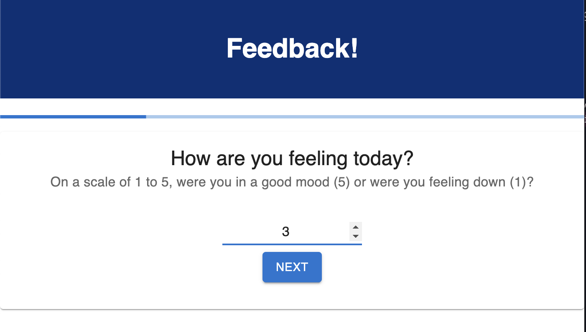
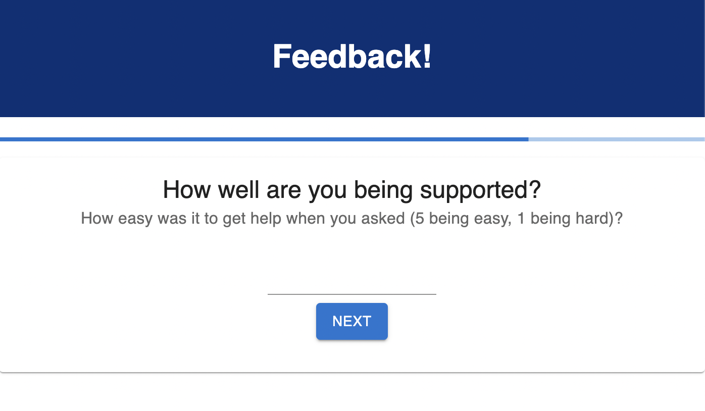
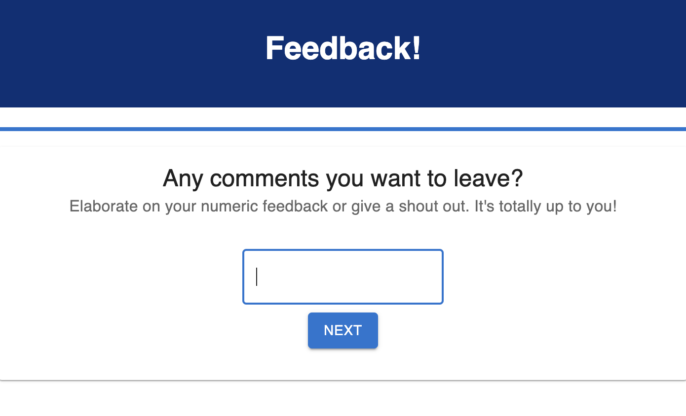
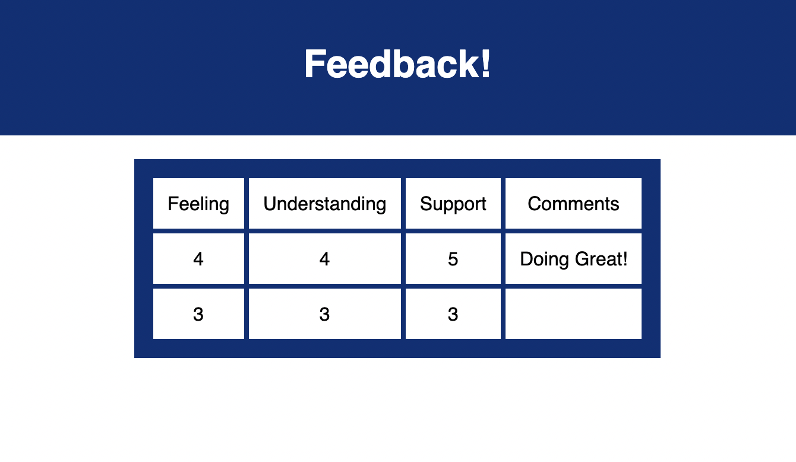

## Feedback Survey

Here's a survey intended to gather the mood, understanding and sense of support of people who have participated in a learning event, like a class or training. 

## Technology

- PostgresSQL and Postico
- React
- Express
- Node
- React Router
- Redux
- Material UI (https://mui.com/)

## Installation

1. Make sure Postgres SQL and Postico are installed. Using Postico, create a database named `prime_feedback`.
2. Run the queries from data.sql to set up the database in Postico.
3. Open your text editor of choice and run an `npm install` in your terminal
4. Run `npm run server` in your terminal.
5. Run `npm run client` in your terminal.
6. Upon running `npm run client`, a new browser tab will open for you!

## Usage

Upon opening the survey, the user will be asked to provide feedback on their general mood or feelings during the day. They can input 1 - 5, 1 being generally unhappy, 3 being ambivalent, and 5 being generally happy. Once they input a number, they will be able to click next, which will take them to the next question.

The next question evaluates their level of understanding on a scale of 1-5. Again, 1 is poor and 5 is the best. Once they have selected a number, they can click next and continue to the next question.

The final required question asks how they would rate their feeling of support on a scale of 1 - 5. 1 is unsupported and 5 is well-supported. 

After support, the user is given the option to elaborate on their experience with a comment. 

When they hit next, they will be taken to a review page where they can review their feedback as a whole. If they want to go back to page to change their feedback, they can click the pencil icon. Once they return back to the review page, they can hit submit.

 If the data is successfully posted to the database, the user will be taken to the success page. 

Finally, the owner of the training event can go to http://localhost:3000/?#/admin to view the survey results. 

## Technologies
-Javascript -CSS -HTML

## Acknowledgement
Thanks to Prime Digital Academy who equipped me with the skills to make this application a reality.